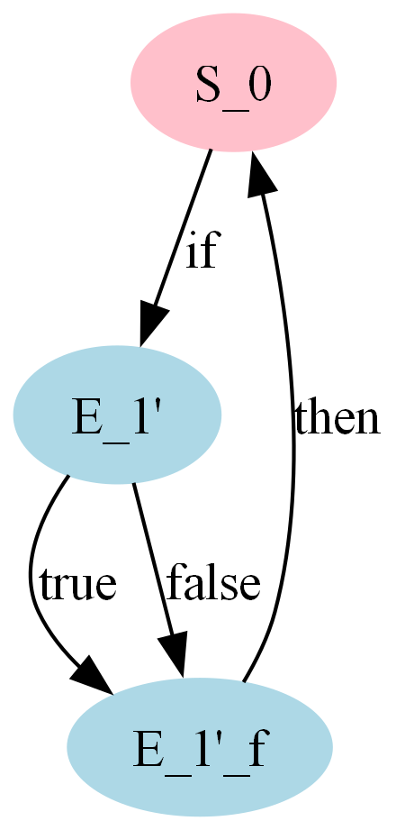
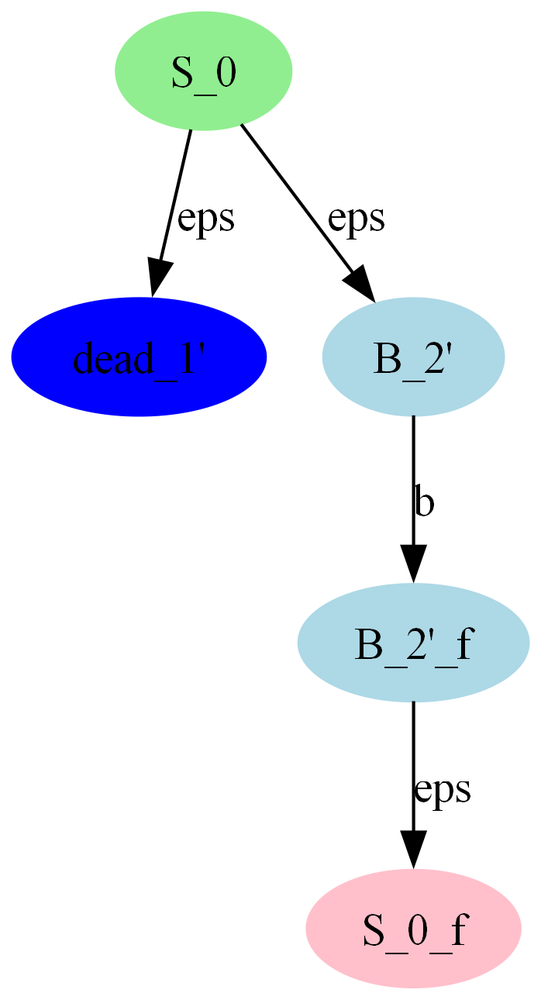
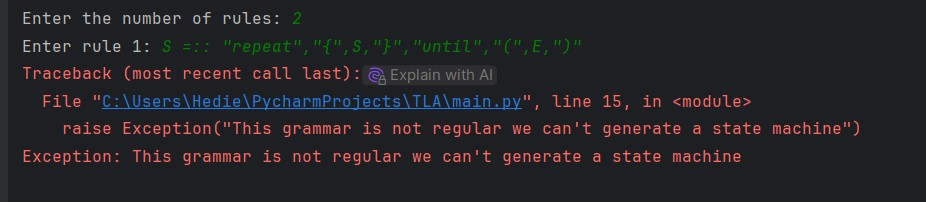

<div align="center">

# TLA State Machine Generator

**A Python-based tool that takes a grammar in Extended Backus-Naur Form (EBNF), analyzes it, and generates a corresponding state machine with a detailed report.**

</div>

---

## ✨ Key Features

-   **📜 EBNF Grammar Parsing**: Takes any grammar in EBNF as input.
-   **🤖 State Machine Generation**: Automatically generates a state machine from the grammar.
-   **🎨 Graphical Visualization**: Displays the state machine as a clean PNG image.
-   **📊 Detailed Analysis**: Provides a rich report on the state machine's properties.
-   **⚠️ Robust Error Handling**: Gracefully manages and reports errors in invalid grammars.

---

## 🚀 Getting Started

Getting the project up and running on your local machine is straightforward.

### Prerequisites

-   Python 3.x
-   **Graphviz**: This is required for graph visualization.
    -   Download it from the [official website](https://graphviz.org/download/).
    -   **Important**: Make sure to add the Graphviz `bin` directory to your system's PATH.

### Installation & Usage

1.  **Clone the repository:**
    ```sh
    git clone [https://github.com/SepehrGhr/TLA-State-Machine-Generator.git](https://github.com/SepehrGhr/TLA-State-Machine-Generator.git)
    cd TLA-State-Machine-Generator
    ```

2.  **Install dependencies:**
    ```sh
    pip install -r requirements.txt
    ```

3.  **Run the application:**
    ```sh
    python src/main.py
    ```

The application will then prompt you for the grammar rules, and once processed, it will display the state machine and save the output files.

---

## 🖼️ Project Showcase

Here are a few examples of what this tool can do. For a more extensive collection, please check out the [`/examples`](./examples) directory.

<details>
<summary><b>✅ If-Then Grammar</b></summary>
<br>

| Grammar                                            | Generated State Machine                             |
| :------------------------------------------------- | :-------------------------------------------------- |
| `S =:: {"if",E,"then"}` <br> `E =:: "true"\|"false"` |  |

</details>

<details>
<summary><b>⚠️ Grammar with a Dead State</b></summary>
<br>

| Grammar                                | Generated State Machine                                 |
| :------------------------------------- | :------------------------------------------------------ |
| `S =:: A\|B`<br>`A =:: A`<br>`B =:: "b"` |  |

</details>

<details>
<summary><b>❌ Handling of Non-Regular Grammars</b></summary>
<br>

The tool identifies non-regular grammars and provides clear error messages.


</details>

---

## 🛠️ Tech Stack

-   **Python**
-   **NetworkX**: For graph creation and manipulation.
-   **Matplotlib**: For displaying the generated graphs.
-   **Pydot**: For interfacing with Graphviz.

---

## 📖 Full Documentation

For a deep dive into the project's architecture, data structures, and algorithms, please read our **[Comprehensive Project Documentation](docs/TLA_Project_Group_18_40220143_40219263.pdf)**.

---

## 🤝 How to Contribute

Contributions, issues, and feature requests are welcome! Feel free to check the [issues page](https://github.com/SepehrGhr/TLA-State-Machine-Generator/issues).

## ✍️ Authors

-   **Sepehr Ghardashi** - [GitHub](https://github.com/SepehrGhr)
-   **Hedie Tahmouresi** -

---

## 📄 License

This project is licensed under the MIT License. See the [LICENSE](./LICENSE) file for details.

