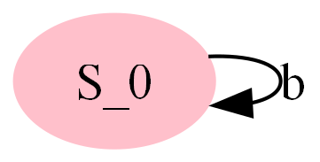
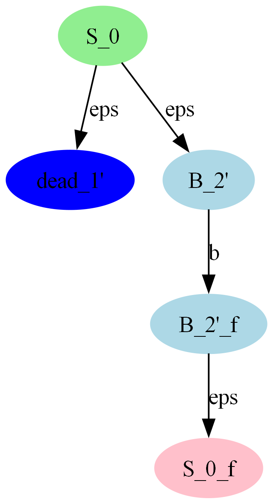
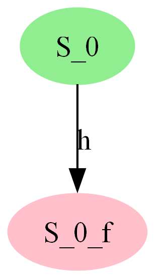

# TLA State Machine Generator

A Python-based tool that takes a grammar in Extended Backus-Naur Form (EBNF), analyzes it, and generates a corresponding state machine. The state machine is then visualized and a detailed report is generated. This project was developed for the "Theory of Languages and Automata" course.

## 📜 Features

* **EBNF Grammar Parsing**: Takes a grammar in EBNF as input.
* **State Machine Generation**: Automatically generates a state machine from the input grammar.
* **Graphical Visualization**: Displays the generated state machine as a PNG image.
* **Detailed Analysis**: Provides a report on the state machine, including:
    * Number of states and transitions.
    * Unreachable variables.
    * Dead states.
    * Grammar and state machine determinism.
* **Error Handling**: Manages and reports errors in the input grammar.

## 📖 Documentation

For a deep dive into the project's architecture, implementation details, and theoretical foundations, please see our comprehensive **[Project Documentation](docs/TLA_Project_Group18_40220143_40219263.pdf)**.

## 🚀 Getting Started

### Prerequisites

* Python 3.x
* Graphviz (for graph visualization). You can download it from [here](https://graphviz.org/download/). Make sure to add it to your system's PATH.

### Installation

1.  Clone the repository:
    ```sh
    git clone [https://github.com/SepehrGhr/TLA-State-Machine-Generator.git](https://github.com/SepehrGhr/TLA-State-Machine-Generator.git)
    ```
2.  Navigate to the project directory:
    ```sh
    cd TLA-State-Machine-Generator
    ```
3.  Install the required packages:
    ```sh
    pip install -r requirements.txt
    ```

### Usage

1.  Run the `main.py` script from the `src` directory:
    ```sh
    python src/main.py
    ```
2.  Follow the prompts in the console to enter the number of rules and the grammar rules in EBNF format.

    **Example Input:**
    ```
    Enter the number of rules: 2
    Enter rule 1: S =:: "a",S,"b"
    Enter rule 2: S =:: "c"
    ```

3.  The program will then:
    * Display the generated state machine in a new window.
    * Save the state machine as `state_machine.png`.
    * Save the detailed analysis as `state_machine_details.txt`.

## 🖼️ Examples

Here are some examples of state machines and reports generated by the tool. You can find more in the [`examples/`](examples/) directory.

### ✅ Valid Grammars

<details>
<summary><b>If-Then Grammar</b></summary>

| Grammar | State Machine |
| :--- | :--- |
| ``` S =:: {"if",E,"then"} <br> E =:: "true"\|"false" ``` |  |

</details>

<details>
<summary><b>Looping Grammar</b></summary>

| Grammar | State Machine |
| :--- | :--- |
| ``` S =:: {"b"} ``` |  |

</details>

### ⚠️ Special Cases

<details>
<summary><b>Dead State</b></summary>

| Grammar | State Machine |
| :--- | :--- |
| ``` S =:: A\|B <br> A =:: A <br> B =:: "b" ``` |  |

</details>

<details>
<summary><b>Unreachable Variable</b></summary>

| Grammar | State Machine |
| :--- | :--- |
| ``` S =:: "h" <br> A =:: "k" ``` |  |

</details>

### ❌ Error Handling

The tool also gracefully handles invalid or non-regular grammars.


## 🤝 Contributing

Contributions, issues, and feature requests are welcome!

## ✍️ Authors

* **Sepehr Ghardashi**
* **Hedieh Tahmouresi** 

## 📄 License

This project is licensed under the MIT License - see the [LICENSE](LICENSE) file for details.